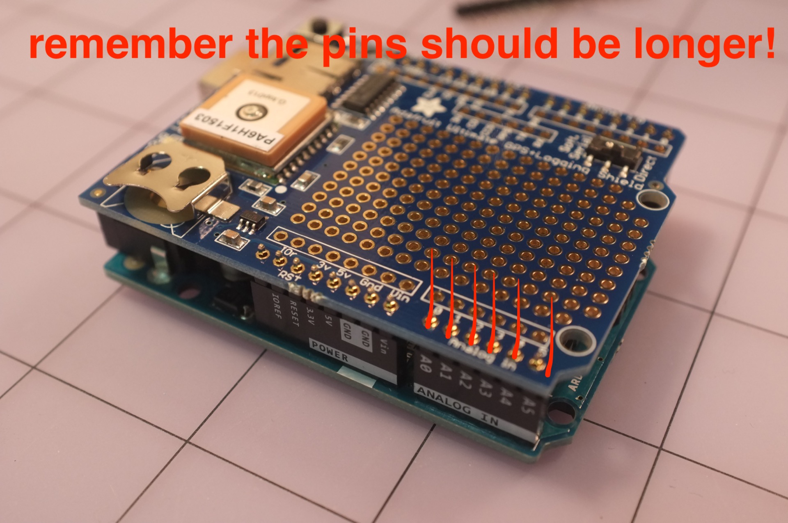

# gpslogger_plus

Most of of this is built from and remixed from these following sources:
- https://github.com/DHDPIC/DATA_WALKING
- https://github.com/ubc-micromet/TIHMMI

## Materials

## Arduino libraries
- SPI: https://www.arduino.cc/en/Reference/SPI
- Adafruit_GPS: https://github.com/adafruit/Adafruit_GPS
- SoftwareSerial: https://www.arduino.cc/en/Reference/SoftwareSerial
- SD: https://www.arduino.cc/en/Reference/SD

## Setup

⚠️️NOTE: VERY IMPORTANT - make sure to use extra long pins to solder from your arduino uno to the adafruit GPS data logger so that you can put female connectors on top of the gps logger. This will allow you to add additional sensors onto the top of the GPS logger board. If you do not do this, you will not be able to connect any additional components onto the arduino board! 

I think you should be able to just flip the header pin pieces that come with the adafruit gps logger so that the small side goes down into the arduino uno and the long bits come up through the bottom of the GPS logger - then you can add the female connectors onto the top of the gps logger.

 via data walking project - you see how those female headers are available? that's what we want :) 

### add the header pins to connect the gps to the arduino uno. Make sure to have long pins so that you can add female connectors to the top of the GPS logger later on

### Make sure the long pins are sticking out of the top of the gps logger so you can add female connectors to the top of the GPS logger later on
 via data walking project - you see how those female headers are available? that's what we want :) 

### make sure to add the gps logger coin cell battery

### Connect and install software - make sure you have all the necessary libraries

* make sure you flip the switch on the gps logger to: (to be noted)

## References

- https://github.com/DHDPIC/DATA_WALKING
- https://github.com/ubc-micromet/TIHMMI